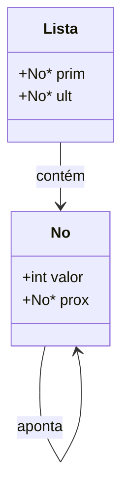
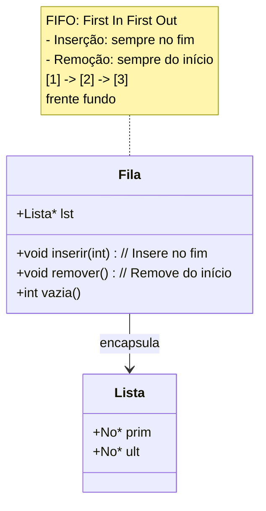
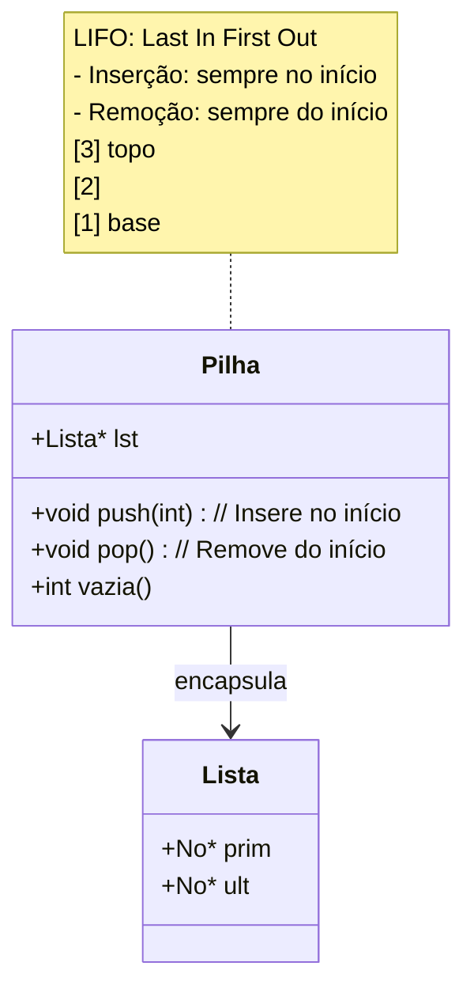

# Implementação de Estruturas de Dados em C

Este projeto implementa três estruturas de dados fundamentais em C: Lista Encadeada, Fila e Pilha. A implementação usa um design modular onde a Fila e a Pilha encapsulam internamente uma Lista Encadeada.

## Estrutura do Projeto

```
.
├── Lista.h         # Header da Lista Encadeada
├── Lista.c         # Implementação da Lista
├── Fila.h          # Header da Fila
├── Fila.c          # Implementação da Fila
├── Pilha.h         # Header da Pilha
├── Pilha.c         # Implementação da Pilha
└── main.c          # Programa de teste
```

## Diagramas das Estruturas

### Lista Encadeada



### Fila (FIFO)



### Pilha (LIFO)



## Funcionamento das Estruturas

### Lista Encadeada
- Estrutura base que mantém nós ligados sequencialmente
- Cada nó contém um valor e um ponteiro para o próximo nó
- A lista mantém referências para o primeiro e último nós
- Operações:
  - Inserção no início
  - Inserção no fim
  - Remoção do início
  - Remoção do fim
  - Impressão dos elementos

### Fila (FIFO - First In First Out)
- Encapsula uma Lista Encadeada
- Inserção sempre no fim (usando lst_inserir_fim)
- Remoção sempre do início (usando lst_remover_inicio)
- Impressão mostra elementos da frente ao fundo
```
Fila: [1, 2, 3, 4]
Frente -> [primeiro elemento] ... [último elemento] <- Fundo
```

### Pilha (LIFO - Last In First Out)
- Encapsula uma Lista Encadeada
- Inserção sempre no início (usando lst_inserir_inicio)
- Remoção sempre do início (usando lst_remover_inicio)
- Impressão mostra elementos do topo à base
```
Pilha: (topo)
   |  3  |
   |  2  |
   |  1  |
   +-----+
   (base)
```

## Como Compilar e Executar

1. Compile todos os arquivos fonte:
```bash
gcc -c Lista.c Fila.c Pilha.c main.c
```

2. Link os objetos em um executável:
```bash
gcc Lista.o Fila.o Pilha.o main.c -o programa
```

3. Execute o programa:
```bash
./programa
```

## Exemplo de Uso

```c
// Testando a Lista
Lista *lst = lst_criar();
lst_inserir_fim(lst, 1);
lst_inserir_fim(lst, 2);
lst_inserir_fim(lst, 3);
lst_imprimir(lst);  // Saída: 1 2 3
lst_limpar(lst);

// Testando a Fila
Fila *f = fila_criar();
fila_inserir(f, 1);
fila_inserir(f, 2);
fila_inserir(f, 3);
fila_imprimir(f);   // Saída: Fila: [1, 2, 3]
fila_destruir(f);

// Testando a Pilha
Pilha *p = pilha_criar();
pilha_push(p, 1);
pilha_push(p, 2);
pilha_push(p, 3);
pilha_imprimir(p);  /* Saída:
                       Pilha: (topo)
                          |  3  |
                          |  2  |
                          |  1  |
                          +-----+
                          (base)  */
pilha_destruir(p);
```

## Testes Sugeridos

1. **Lista Encadeada**:
   - Inserir elementos no início e fim
   - Remover elementos do início e fim
   - Tentar remover de lista vazia
   - Inserir após remover todos elementos

2. **Fila**:
   - Inserir vários elementos
   - Remover alguns elementos e verificar ordem FIFO
   - Tentar remover de fila vazia
   - Inserir após esvaziar a fila

3. **Pilha**:
   - Empilhar vários elementos
   - Desempilhar alguns e verificar ordem LIFO
   - Tentar desempilhar de pilha vazia
   - Empilhar após esvaziar a pilha

## Observações Importantes

- Todas as estruturas fazem verificação de ponteiros nulos
- A memória é gerenciada adequadamente com malloc/free
- As funções de impressão respeitam as políticas de cada estrutura
- A modularização permite fácil manutenção e reuso
- Os headers estão documentados com comentários detalhados